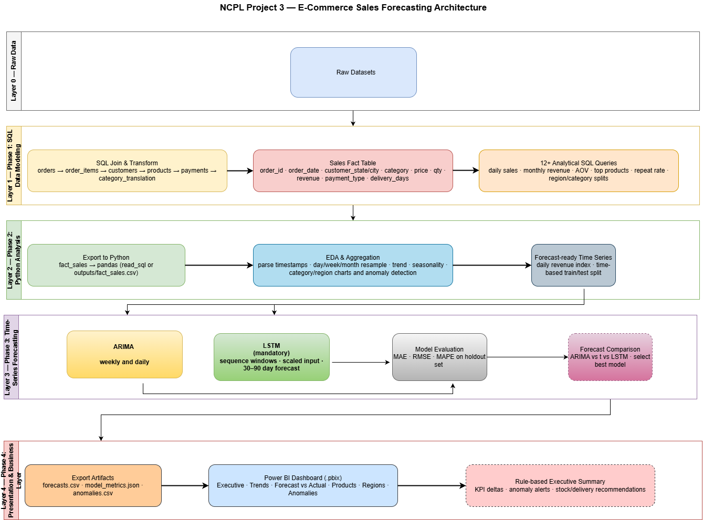

# E-Commerce Sales Forecasting and Intelligent Reporting

## Project Overview

This project analyzes e-commerce sales data and builds forecasting models to estimate future daily sales revenue. The workflow connects SQL data modeling, Python-based time series forecasting, model evaluation, and Power BI business reporting.

The goal is to identify sales patterns, compare forecasting approaches, and present results in a dashboard that supports business reporting and planning.

## Architecture

The architecture below shows the full project workflow from raw data, SQL modeling, Python forecasting, model evaluation, and Power BI reporting.

Architecture image: [Project3-Architecture.png](Project3-Architecture.png)

## Dataset

The main analytical dataset used for modeling and reporting is:

- [Dataset/sales_fact.csv](Dataset/sales_fact.csv)

The `sales_fact.csv` table is the final sales fact table created from SQL joins and transformations. It is structured at the order-item level and contains the core fields used for revenue analysis and time series forecasting.

## SQL Data Modeling

SQL was used to join and transform the raw e-commerce tables into the final `sales_fact` table. The table combines order item details, order dates, customer locations, product categories, payment information, delivery time, and revenue fields.

Sales fact documentation: [sales_fact_table_documentation.md](sales_fact_table_documentation.md)

## SQL Exploration

SQL queries were used to explore sales performance before forecasting. The analysis included daily sales, monthly revenue, revenue by category, revenue by region and city, average order value, top-selling products, repeat customer rate, and delivery time by region.

SQL analysis file: [ecommerce_sql_queries_and_findings.md](ecommerce_sql_queries_and_findings.md)

Key findings included:

- Highest daily sales: 2017-11-24
- Highest monthly revenue: November 2017
- Top revenue regions: SP, RJ, and MG
- Average order value: 137.75
- Customer repeat rate: 3.12%

## Python Analysis and Time Series Preparation

Python was used to aggregate item-level revenue into daily sales revenue. Missing dates were filled to create a continuous daily time series, which was required for time series forecasting models.

The notebook also includes exploratory analysis, aggregation, time series preparation, ARIMA modeling, LSTM modeling, evaluation, and forecast comparison.

Notebook: [ecommerce_documented_code.ipynb](ecommerce_documented_code.ipynb)

## Forecasting Models

Two forecasting models were compared: ARIMA and LSTM.

### ARIMA

ARIMA was used as a statistical baseline forecasting model. The model uses past sales values and past forecast errors to estimate future sales. First differencing was applied because the original training series showed an upward trend.

### LSTM

LSTM was used as a deep learning comparison model for sequential forecasting. The model used a lookback window so that previous sales values could be used to predict the next sales value.

## Model Evaluation

The models were evaluated using MAE, RMSE, MAPE, and WAPE.

ARIMA was selected as the preferred baseline because it achieved lower MAE and WAPE, making it more useful from a business reporting perspective. LSTM remained useful as a comparison model, but it did not provide a clear advantage with the available dataset size and limited input features.

## Final Model Comparison

| Model | MAE | RMSE | MAPE | WAPE | Assessment |
|---|---:|---:|---:|---:|---|
| ARIMA | 11,693.3 | 14,271.6 | 420.1% | 43.52% | Preferred baseline based on lower MAE and WAPE |
| LSTM | 12,173.2 | 14,040.9 | 329.6% | 45.31% | Useful comparison model, but may improve with more data and features |

## Power BI Reporting

Power BI was used to visualize the final findings and communicate business insights. The dashboard supports reporting on sales trends, forecast comparisons, product performance, regional insights, anomalies, and executive-level summaries.

Power BI dashboard: [View Power BI Dashboard](https://app.powerbi.com/view?r=eyJrIjoiZmFkYTNkNTMtNmE5Mi00ZTdjLWExYzYtOGRmNWE0ODk2NmM5IiwidCI6ImNkMzE5NjcxLTUyZTctNGE2OC1hZmE5LWZjZjhmODlmMDllYSIsImMiOjN9)

## Documentations

| File name | What it does |
|---|---|
| [README.md](README.md) | Main project overview, workflow, links, architecture, model comparison, and dashboard link. |
| [sales_fact_table_documentation.md](sales_fact_table_documentation.md) | Documents the `sales_fact` table, its grain, columns, null handling, and forecasting relevance. |
| [ecommerce_sql_queries_and_findings.md](ecommerce_sql_queries_and_findings.md) | Contains SQL queries and key findings from sales exploration. |
| [ecommerce_documented_code.ipynb](ecommerce_documented_code.ipynb) | Main Python notebook for analysis, time series preparation, modeling, and evaluation. |
| [ecommerce_sales_forecasting_research_report.docx](ecommerce_sales_forecasting_research_report.docx) | Research-style project report explaining methodology, modeling approach, results, limitations, and future work. |
| [Project3-Architecture.png](Project3-Architecture.png) | Visual architecture diagram showing the full project pipeline. |
| [Dataset/sales_fact.csv](Dataset/sales_fact.csv) | Final analytical sales fact table used for analysis, forecasting, and reporting. |

## Business Value

This project supports business planning by helping stakeholders:

- Monitor daily and monthly sales trends
- Identify high-performing product categories and regions
- Compare forecasting model performance
- Support inventory and revenue planning
- Review insights through Power BI reporting

## Limitations and Future Work

The project has several limitations. The time series contains only about two years of daily sales, which limits the amount of historical behavior available for modeling. The forecasting models also rely mainly on historical sales values and do not include external variables such as holidays, promotions, weekday effects, product category, or customer region.

Future improvements could include SARIMA or SARIMAX models, additional external features, weekly forecasting, category-level forecasting, regional forecasting, and improved dashboard automation.
